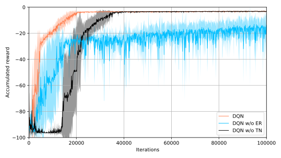

# DQN-cartpole

In this project, I implemented the Reinforcement Learning approach Deep Q-Network (DQN) [1] to stabilize the well-known 
cart pole control task. The cart pole equations are based on [2]. The implementation uses Tensorflow 2.0.

The state representation is directly inputted to a fully connected neural network, which outputs one Q-value per 
discrete action. To visualize the effect of experience replay and a separate target network, I conducted experiements removing each 
component. Note that experience replay removes the correlation within the input data, and a separate target network
improves the stationarity of the targets in the Q-learning update.

Average accumulated reward of 5 runs. The filled area corresponds to one standard deviation.
”w/o  ER” denotes without experience replay, ”w/o TN” denotes without target network.

Video of the DQN controlling the cart pole. Experience replay and the separate target network are enabled.

<video src="videos/DQN/DQN.mp4" width="600" height="200" />

Video of the DQN controlling the cart pole with a disturbance force of 10 N at 5 seconds applied to the cart. 
Experience replay and the separate target network are enabled.

<video src="videos/DQN/DQN_Disturbance10N.mp4" width="600" height="200" />

### References

[1] V. Mnih et al., “Human-level control through deep reinforcement learning,” Nature, vol. 518, no. 7540, pp. 529–533, 2015.

[2] M. P. Deisenroth, “Efficient reinforcement learning using Gaussian processes,” Karlsruhe Ser. Intell. Sensor-Actuator-Systems, vol. 9, pp. IX, 205 S., 2010.